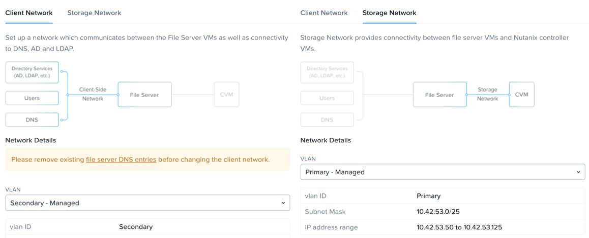

.. title:: Files

--------------------------------
Consolidating Storage with Files
--------------------------------

*The estimated time to complete this lab is 45 minutes.*

Traditionally, file storage has been yet another silo within IT, introducing unnecessary complexity and suffering from the same issues of scale and lack of continuous innovation seen in SAN storage. Nutanix believes there is no room for silos in the Enterprise Cloud. By approaching file storage as an app, running in software on top of a proven HCI core, Nutanix Files  delivers high performance, scalability, and rapid innovation through One Click management.

**In this lab you will work with Files to manage SMB shares and NFS exports and explore the new functionality for Files deployments with File Analytics.**

For the purpose of time, and sharing infrastructure resources, a Files cluster has already been provisioned on your cluster. The **BootcampFS** Files is a single node instance, typical **Files** deployments would start with 3 File Server VMs, with the ability to scale up and scale out as required for performance.

**BootcampFS** has been configured to use the **Primary** network to communicate with the backend storage, iSCSI connections from the **CVM** to **Volume Groups**, and the **Secondary** network for communication with clients, Active Directory, anti-virus services, etc.

.. note::

  It is typically desirable in production environments to deploy Files with dedicated virtual networks for client and storage traffic. When using two networks, Files will, by design, disallow client traffic the storage network, meaning VMs assigned to the primary network will be unable to access shares.

As Files leverages Nutanix Volume Groups for data storage, it can take advantage of the same underlying storage benefits such as compression, erasure coding, snapshots, and replication.

In **Prism Element > File Server > File Server**, select **BootcampFS** and click **Protect**.

   .. figure:: images/10.png

Observe the default Self Service Restore schedules, this feature controls the snapshot schedule for Windows' Previous Versions functionality. Supporting Windows Previous Versions allows end users to roll back changes to files without engaging storage or backup administrators. Note these local snapshots do not protect the file server cluster from local failures and that replication of the entire file server cluster can be performed to remote Nutanix clusters.

Multi-Protocol Shares
+++++++++++++++++++++

Files provides the ability to provision both SMB shares and NFS exports separately - but also now supports the ability to provide multi-protocol access to the same share. In the exercise below, you will configure your existing *Initials*\ **-FiestaShare** to allow NFS access, allowing developer users to re-direct application logs to this location.

Configure User Mappings
.......................

A Nutanix Files share has the concept of a native and non-native protocol.  All permissions are applied using the native protocol. Any access requests using the non-native protocol requires a user or group mapping to the permission applied from the native side. There are several ways to apply user and group mappings including rule based, explicit and default mappings.  You will first configure a default mapping.

#. In **Prism Element > File Server**, select your file server and click **Protocol Management > User Mapping**.

#. Click **Next** twice to advance to **Default Mapping**.

#. From the **Default Mapping** page choose both **Deny access to NFS export** and **Deny access to SMB share** as the defaults for when no mapping is found.

   .. figure:: images/31.png

#. Click **Next > Save** to complete the default mapping.

#. In **Prism Element > File Server**, select your *Initials*\ **-FiestaShare** and click **Update**.

#. Under **Basics**, select **Enable multiprotocol access for NFS** and click **Next**.

   .. figure:: images/32.png

#. Under **Settings > Multiprotocol Access** select **Simultaneous access to the same files from both protocols**.

   .. figure:: images/33.png

#. Click **Next > Save** to complete updating the share settings.

Testing the Export
.......................

#. To test the NFS export, connect via SSH to your *Initials*\ **-LinuxToolsVM** VM:

   - **User Name** - root
   - **Password** - nutanix/4u

#. Execute the following commands:

     .. code-block:: bash

       [root@CentOS ~]# yum install -y nfs-utils #This installs the NFSv4 client
       [root@CentOS ~]# mkdir /filesmulti
       [root@CentOS ~]# mount.nfs4 bootcampfs.ntnxlab.local:/<Initials>-FiestaShare /filesmulti
       [root@CentOS ~]# dir /filesmulti
       dir: cannot open directory /filesmulti: Permission denied
       [root@CentOS ~]#

   .. note:: The mount operation is case sensitive.

Because the default mapping is to deny access the Permission denied error is expected. You will now add an explicit mapping to allow access to the non-native NFS protocol user. We will need to get the user ID (UID) to create the explicit mapping.

#. Execute the following command and take note of the UID:

     .. code-block:: bash

       [root@CentOS ~]# id
       uid=0(root) gid=0(root) groups=0(root)
       [root@CentOS ~]#

#. In **Prism Element > File Server**, select your file server and click **Protocol Management > User Mapping**.

#. Click **Next** to advance to **Explicit Mapping**.

#. Under **One-to-onemapping list**, click **Add manually**.

#. Fill out the following fields:

   - **SMB Name** - NTNXLAB\\devuser01
   - **NFS ID** - UID from previous step (0 if root)
   - **User/Group** - User

   .. figure:: images/34.png

#. Under **Actions**, click **Save**.

#. Click **Next > Next > Save** to complete updating your mappings.

#. Return to your *Initials*\ **-LinuxToolsVM** SSH session and try to access the share again:

     .. code-block:: bash

       [root@CentOS ~]# dir /filesmulti
       Documents\ -\ Copy  Graphics\ -\ Copy  Pictures\ -\ Copy  Presentations\ -\ Copy  Recordings\ -\ Copy  Technical\ PDFs\ -\ Copy  XYZ-MyFolder
       [root@CentOS ~]#

#. From your SSH session, create a text file and then validate you can access the file from your Windows client.

Takeaways
+++++++++

What are the key things you should know about **Nutanix Files**?

- Files can be rapidly deployed on top of existing Nutanix clusters, providing SMB and NFS storage for user shares, home directories, departmental shares, applications, and any other general purpose file storage needs.
- Files is not a point solution. VM, File, Block, and Object storage can all be delivered by the same platform using the same management tools, reducing complexity and management silos.
- Files can scale up and scale out with One Click performance optimization.
- File Analytics helps you better understand how data is utilized by your organizations to help you meet your data auditing, data access minimization and compliance requirements.
